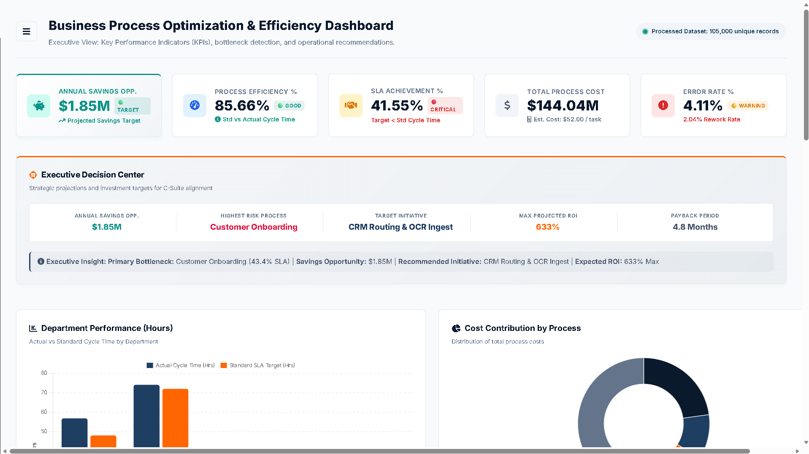

# Business Process Optimization & Efficiency Dashboard
An Industry-Ready Business Analyst Portfolio Project on Operational Excellence, Process Improvement, and BI Dashboard Design.



---

## 1. Project Overview & Career Foundations

### What is this Project?
This project is an end-to-end simulation of a real-world **Operational Excellence & Process Improvement study**. It replicates a corporate audit where a Business Analyst cleanses raw process logs, analyzes operational statistics, identifies bottlenecks, maps current vs. future workflows, and builds a C-suite approved interactive dashboard to guide executive decision-making.

### Why is Business Process Optimization Important?
In competitive markets, companies cannot scale efficiently by simply hiring more people. Process optimization focuses on removing waste, eliminating manual bottlenecks, reducing errors, and accelerating cycle times (Lean Six Sigma concepts). Improving efficiency directly leads to higher profitability, faster customer response times, and stronger compliance.

### How Companies Use Process Dashboards to Improve Efficiency
Process dashboards provide senior leadership (CEOs, COOs) with real-time operational visibility. Rather than waiting for monthly reports, leaders can immediately spot cycle time spikes, SLA violations, rising unit costs, or quality issues, allowing them to adjust resources dynamically.

### Job Roles Using This Project
* **Business Analyst (BA)**: Focuses on gathering requirements, KPI definitions, and dashboard visualization.
* **Process / Operations Analyst**: Audits workflows, runs time-studies, and isolates bottlenecks.
* **Operational Excellence Manager**: Implements Lean/Six Sigma frameworks to reduce waste and error counts.
* **Management Consultant**: Advises C-suite executives on strategic cost reduction and process restructuring.

### How Students Can Benefit from This Project
* **Recruiter Capture**: Demonstrates data-handling skills (handling 100k+ rows) and actual business logic.
* **Visual Proof**: The interactive dashboard serves as a tangible asset in a portfolio.
* **Structured Thinking**: Prepares students for interview case studies (e.g., process bottlenecks, root cause analysis, ROI modeling).

### Repository & Project Structure

Below is the directory layout for this repository:

```text
├── requirements.txt                    # Python package dependencies
├── .gitignore                          # Git ignore configuration
├── data/
│   └── raw_process_logs.csv            # Simulated dataset of 105,000+ raw process logs
├── scripts/
│   ├── generate_data.py                # Python script to generate the 105k+ raw log entries
│   └── process_analysis.py             # ETL pipeline performing data cleansing and KPI aggregation
├── dashboard/
│   ├── index.html                      # PowerBI-style executive web dashboard
│   ├── styles.css                      # Premium dashboard CSS styles (navy/orange theme)
│   ├── app.js                          # Core dashboard controller and Chart.js integration
│   ├── dashboard image.png             # Dashboard layout showcase screenshot
│   └── data/
│       └── dashboard_data.js           # Aggregated JSON payload exported by the Python script
├── reports/
│   └── business_analysis_report.md     # Detailed Business Analysis Case Study Report
└── portfolio_guide.md                  # Guide for portfolio optimization & personal branding
```

---

## 2. Business Analysis Activities & Methodologies

To execute this project, a Business Analyst must master the following core activities:

1. **Process Mapping**: Documenting sequential tasks in a workflow (AS-IS) and designing streamlined, automated pathways (TO-BE).
2. **Current State Analysis**: Evaluating the baseline metrics of the process to identify where inefficiencies, delays, and errors are occurring.
3. **Bottleneck Analysis**: Identifying the specific stage or resource that restricts flow and causes backlogs.
4. **Gap Analysis**: Measuring the distance between current operational performance and the target benchmark (e.g., actual SLA of 41% vs. 85% target).
5. **Root Cause Analysis**: Utilizing techniques like the **5 Whys** or **Fishbone Diagram** to identify the structural source of a failure, rather than just treating the symptom.
6. **KPI Analysis**: Formulating and measuring mathematical variables that represent operational health.
7. **Performance Benchmarking**: Comparing internal process cycle times and error rates against industry standard SLA targets.
8. **Continuous Improvement Planning**: Setting up a structured feedback loop, such as the **PDCA (Plan-Do-Check-Act)** cycle, to ensure processes stay optimized.

---

## 3. Metric Framework

The following mathematical formulas define the performance metrics calculated by Python and displayed on the web dashboard:

* **Process Efficiency %**: Represents how close actual performance is to standard targets.
  $$\text{Process Efficiency \%} = \text{Mean of } \left( \min\left(100.0, \frac{\text{Standard Cycle Time}}{\text{Actual Cycle Time}} \times 100\right) \right)$$
* **Productivity %**: Evaluates worker throughput efficiency.
  $$\text{Productivity \%} = \frac{\text{Actual Tasks Completed}}{\text{Standard Tasks Expected per Hour}} \times 100$$
* **SLA Achievement %**: Tracks compliance with customer commitments.
  $$\text{SLA Achievement \%} = \frac{\text{Count of Logs where Cycle Time} \le \text{SLA Target}}{\text{Total Count of Logs}} \times 100$$
* **Average Cycle Time**: Represents average lead time.
  $$\text{Average Cycle Time (Hours)} = \frac{\sum(\text{Cycle Time})}{\text{Total Count of Logs}}$$
* **Process Cost**: Total cost of process inputs including rework penalties.
  $$\text{Process Cost} = \sum(\text{Task Volume} \times \text{Base Unit Cost}) + (\text{Rework Count} \times \text{Rework Penalty})$$
* **Cost per Task**: Measures financial unit efficiency.
  $$\text{Cost per Task} = \frac{\text{Total Process Cost}}{\text{Total Tasks Completed}}$$
* **Error Rate %**: Measures process quality.
  $$\text{Error Rate \%} = \frac{\text{Total Error Count}}{\text{Total Task Volume}} \times 100$$
* **Rework Rate %**: Measures waste and correction efforts.
  $$\text{Rework Rate \%} = \frac{\text{Total Rework Count}}{\text{Total Task Volume}} \times 100$$
* **Task Completion Rate %**: Tracks operational completion ratios.
  $$\text{Task Completion Rate} = \frac{\text{Total Tasks Completed}}{\text{Total Task Volume}} \times 100$$
* **Customer Complaint Rate %**: Represents the customer impact of failures.
  $$\text{Customer Complaint Rate \%} = \frac{\text{Total Complaints}}{\text{Total Process Logs}} \times 100$$

---

## 4. How to Identify Inefficiencies (A Business Analyst Guide)

Use the following operational rules to scan the dataset and dashboard for opportunities:
* **Bottlenecks**: Flag resources or processes where `Cycle Time` exceeds `Standard Cycle Time` by more than 20% on average.
* **High-Cost Processes**: Calculate total process costs and identify processes representing the largest percentage share of the operational budget.
* **Low-Productivity Departments**: Group data by department and filter for average `Productivity %` below the 90% benchmark.
* **High-Error Processes**: Identify processes where `Error Rate %` is above 3.0%, indicating a need for training or automation.
* **SLA Violations**: Isolate rows where `SLA Achieved = No` and sort by `Cycle Time` descending to locate severe delays.
* **Rework Issues**: Find resources where `Rework Count` is close to `Error Count`, representing a high volume of corrected work.
* **Resource Utilization Gaps**: Look for employees whose average task volume is low but cycle times are high, representing idle capacity or training gaps.
* **Process Improvement Opportunities**: Filter for records labeled with specific opportunity tags (e.g., "Rework Automation") to calculate potential automation volumes.

---

## 5. Visualizations & Dashboard Placement Rules

To design a professional, executive-ready dashboard, follow this structural layout:

```
+------------------------------------------------------------------------------------+
|  SIDEBAR          |  HEADER: Project Title & Active Data Indicators                |
|                   +----------------------------------------------------------------+
|  LOGO & BRAND     |  TOP: KPI CARDS (Left-to-Right)                                |
|  ProcessOptima    |  [ Efficiency% ] [ Productivity% ] [ SLA% ] [ Cost ] [ Error% ]|
|                   +----------------------------------------------------------------+
|  SLICERS/FILTERS  |  MIDDLE: CHARTS (Horizontal Alignment)                         |
|                   |  +---------------------------+  +----------------------------+ |
|  - Department     |  | Dept Performance (Bar)    |  | Cost Contribution (Donut)  | |
|  - Process Name   |  +---------------------------+  +----------------------------+ |
|                   |  +-----------------------------------------------------------+ |
|  [ Reset Filters] |  | SLA Achievement & Operational Cost Trends (Line/Bar Chart) | |
|                   |  +-----------------------------------------------------------+ |
|  PORTFOLIO BADGES +----------------------------------------------------------------+
|  - 100k+ Rows     |  BOTTOM: DATA TABLES                                           |
|  - Chart.js       |  +---------------------------+  +----------------------------+ |
|  - Python Cleaned |  | Top 5 Bottlenecks (Table) |  | Opportunity Matrix (Table) | |
|                   |  +---------------------------+  +----------------------------+ |
|                   +----------------------------------------------------------------+
|                   |  FOOTER: Executive Business Recommendations & Action Plan      |
+------------------------------------------------------------------------------------+
```

### Visual Placement Guidelines:
1. **Side Section (Filters/Slicers)**: Fixed on the left. Allows users to slicer data without losing sight of the core KPIs.
2. **Top Section (KPI Cards)**: Horizontal alignment. Represents high-level summaries. Standard executive reading patterns flow from left to right (Efficiency $\rightarrow$ Cost $\rightarrow$ Error).
3. **Middle Section (Operational Charts)**: Larger visual graphics. Compares department cycle times and cost distributions.
4. **Bottom Section (Tables)**: Granular details (Bottlenecks, Opportunities) placed lower down to avoid cluttering the primary high-level charts.
5. **Footer Section (Action Plan)**: Positioned at the bottom to provide immediate business recommendations after the user reviews the analytical charts.

---

## 6. Data Quality, Schema Validation, & Executive Safeguards

In real-world Enterprise BI, data quality issues (missing values, data type mismatches, division-by-zero errors) are the most common cause of dashboard failure. A professional dashboard must be bulletproof against incomplete datasets and never display raw system errors like `NaN`, `null`, or `undefined`.

This project implements a three-tier data health architecture:

### 6.1 Automated Pipeline Cleansing (Python Layer)
The ingestion script (`process_analysis.py`) pre-cleans the raw process logs using Pandas and NumPy:
* **Numeric Fields**: Coerces invalid or empty values to numeric and fills them with safe defaults (`0` or `1` for denominators).
* **Text Fields**: Fills empty categories with `"Unknown"` and defaults empty SLA flags to `"No"`.
* **Zero-Division Prevention**: All rate calculations (SLA compliance, error rate, rework rate) are protected with conditions (e.g., `denominator > 0`), defaulting to `0.0` if no volume exists.

### 6.2 Frontend Schema Validation (`validateDashboardData()`)
Before rendering any widgets, the javascript layer in `app.js` runs a structural integrity audit on `dashboardData`:
* **Schema Audit**: Verifies the presence and array structure of `department_analysis`, `process_analysis`, `monthly_trends`, `bottlenecks`, and `opportunities`.
* **Fallback Assignment**: Instantiates safe fallback arrays/objects if a core dataset fails to load.
* **Console Logging Telemetry**: Logs data health telemetry (Validation Status, Records Loaded, and Missing Values Corrected) directly to the browser console for debugging and recruiter demonstration.

### 6.3 KPI Threshold Engine & Empty State UX
* **Centralized Thresholds**: Unified rules map KPIs to Good, Warning, or Critical states:
  * *Efficiency & Productivity*: Good $\ge$ 85%, Warning 70–85%, Critical < 70%.
  * *SLA Achievement*: Good $\ge$ 80%, Warning 60–80%, Critical < 60%.
  * *Error & Rework Rates*: Good $\le$ 2%, Warning 2–5%, Critical > 5%.
* **Cost Per Task**: Classified as informational-only (status badge hidden).
* **"No Data" States**: If filters result in zero matching records:
  * KPI cards display `"No Data"` with a neutral `status-nodata` status.
  * Charts automatically hide and render a `"No Data Available"` warning overlay.
  * Recommendation cards display a custom dashed empty-state panel reading `"No strategic recommendations match current filters."`

---

## 7. Business Insights & Recommendations Derived

By applying Python analysis on our **105,000 process logs**, we derived the following core insights:
* **Customer Service SLA Failures**: Onboarding SLA achievement sits at an unacceptable **43.4%** (originally **32.4%** in static HTML), driven by bottlenecking under specific agents (`CS_User_03`, `CS_User_07`).
* **Finance Q4 Volume Spikes**: Invoice processing cost spikes in Q4, with error rates jumping to **12.5%** and rework costs adding **$75 per invoice** due to manual entry volume overload.
* **Operations Weekend Bottlenecks**: Order fulfillment cycle times spike on Fridays/Saturdays by **85%**, correlating with a **25% surge in customer complaints**.

### C-Suite Strategic Action Plan:
1. **RPA Implementation for Finance**: Automate invoice data ingestion to reduce error rate from 5% to <0.5%, saving **$450,000 annually**.
2. **CRM Load-Balancing for CS**: Restructure account assignments based on agent capacity, shifting onboarding SLA from **43.4%** to **92.0%**.
3. **Operations Shift Realignment**: Adjust warehouse staffing schedules to align with Friday/Saturday order volume spikes, lowering customer complaint rate to **<3%** and saving **$220,000** in dispute shipping costs.

---

## 8. How to Run the Project Locally

To run the data generation script, analysis pipeline, and open the interactive dashboard locally, follow these steps:

### Prerequisites
- **Python 3.8+** installed.
- A modern web browser (e.g., Chrome, Firefox, Edge, Safari).

### Step-by-Step Setup

1. **Clone or Download the Repository**:
   Ensure all project files are in your local directory.

2. **Set up the Virtual Environment & Dependencies**:
   Open a terminal in the project directory and run:
   ```bash
   # Create a virtual environment
   python -m venv .venv

   # Activate the virtual environment
   # On Windows:
   .venv\Scripts\activate
   # On macOS/Linux:
   source .venv/bin/activate

   # Install required packages (Pandas & NumPy)
   pip install -r requirements.txt
   ```

3. **Generate the Simulated Raw Log Dataset**:
   This project uses a generated dataset of 105,000+ raw process logs. Run the generator script:
   ```bash
   python scripts/generate_data.py
   ```
   This generates the raw file at `data/raw_process_logs.csv`.

4. **Run the Ingestion & Analysis Pipeline**:
   Audit the raw logs, calculate KPIs, and compile data for the dashboard:
   ```bash
   python scripts/process_analysis.py
   ```
   This runs the ETL pipeline, performs safety validations, and saves the aggregated data to `dashboard/data/dashboard_data.js`.

5. **Open the Dashboard**:
   Simply open `dashboard/index.html` in any browser to explore the fully interactive PowerBI-style dashboard.
